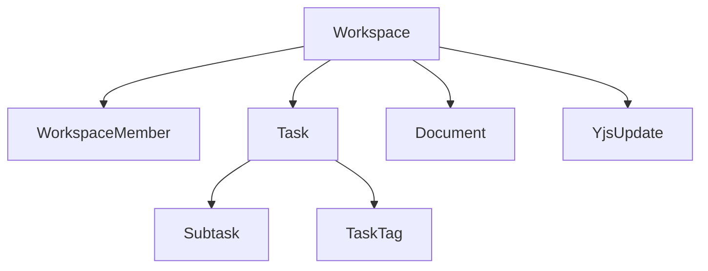

# DevFlow - Chi tiết Entity Storage Backend

## Tổng quan Database Schema

DevFlow sử dụng **PostgreSQL** làm database chính với **Spring Data JPA/Hibernate** cho ORM. Database được cấu hình với `ddl-auto=update` để tự động tạo/cập nhật schema từ entity annotations.

### Database Configuration
```properties
# application.properties
spring.datasource.url=jdbc:postgresql://localhost:5432/naver_hackathon
spring.datasource.username=postgres
spring.datasource.password=12345
spring.jpa.hibernate.ddl-auto=update
spring.jpa.show-sql=true
```

## 1. Entity Mapping Chi tiết

### 1.1 Task Entity - Lưu trữ Tasks

```java
@Entity
@Table(name = "tasks")
public class Task {
    @Id
    @GeneratedValue(strategy = GenerationType.UUID)
    private String id; // UUID primary key

    @Column(nullable = false, length = 200)
    private String title; // Task title (required, max 200 chars)

    @Column(length = 1000)
    private String description; // Task description (optional, max 1000 chars)

    @Enumerated(EnumType.STRING)
    @Column(nullable = false)
    private TaskStatus status; // Todo, In_Progress, Done

    @Enumerated(EnumType.STRING)
    @Column(nullable = false)
    private TaskPriority priority; // Low, Medium, High

    private LocalDateTime dueDate; // Optional deadline

    @Column(name = "user_id", nullable = false, length = 160)
    private String userId; // Clerk user ID

    @Column(name = "workspace_id", length = 160)
    private String workspaceId; // Associated workspace

    // Tags stored as separate table
    @ElementCollection
    @CollectionTable(name = "task_tags", joinColumns = @JoinColumn(name = "task_id"))
    @Column(name = "tag")
    private List<String> tags = new ArrayList<>();

    // One-to-many relationship with subtasks
    @OneToMany(mappedBy = "task", cascade = CascadeType.ALL, orphanRemoval = true)
    @OrderBy("id ASC")
    private List<Subtask> subtasks = new ArrayList<>();

    @Column(nullable = false)
    private Integer orderIndex; // For drag & drop ordering

    // Audit fields
    @Column(nullable = false)
    private LocalDateTime createdAt;
    @Column(nullable = false)
    private LocalDateTime updatedAt;
}
```

**Database Schema Generated:**
```sql
CREATE TABLE tasks (
    id VARCHAR(36) PRIMARY KEY,
    title VARCHAR(200) NOT NULL,
    description VARCHAR(1000),
    status VARCHAR(20) NOT NULL,        -- 'Todo', 'In_Progress', 'Done'
    priority VARCHAR(20) NOT NULL,      -- 'Low', 'Medium', 'High'
    due_date TIMESTAMP,
    user_id VARCHAR(160) NOT NULL,
    workspace_id VARCHAR(160),
    order_index INTEGER NOT NULL,
    created_at TIMESTAMP NOT NULL,
    updated_at TIMESTAMP NOT NULL
);

-- Separate table for tags (many-to-many)
CREATE TABLE task_tags (
    task_id VARCHAR(36) NOT NULL,
    tag VARCHAR(50) NOT NULL,
    FOREIGN KEY (task_id) REFERENCES tasks(id) ON DELETE CASCADE
);
```

### 1.2 Subtask Entity - Lưu trữ Subtasks

```java
@Entity
@Table(name = "subtasks")
public class Subtask {
    @Id
    @GeneratedValue(strategy = GenerationType.UUID)
    private String id;

    @Column(nullable = false)
    private String title;

    @Column(nullable = false)
    private Boolean done; // Completion status

    // Many-to-one relationship with Task
    @ManyToOne(fetch = FetchType.LAZY)
    @JoinColumn(name = "task_id", nullable = false)
    @JsonBackReference
    private Task task;
}
```

**Database Schema:**
```sql
CREATE TABLE subtasks (
    id VARCHAR(36) PRIMARY KEY,
    title VARCHAR(200) NOT NULL,
    done BOOLEAN NOT NULL,
    task_id VARCHAR(36) NOT NULL,
    FOREIGN KEY (task_id) REFERENCES tasks(id) ON DELETE CASCADE
);
```

### 1.3 Workspace Entity - Lưu trữ Workspaces

```java
@Entity
@Table(name = "workspaces")
public class Workspace {
    @Id
    @GeneratedValue(strategy = GenerationType.UUID)
    private String id;

    @Column(nullable = false, length = 200)
    private String name;

    @Column(length = 1000)
    private String description;

    @Column(name = "owner_id", nullable = false, length = 160)
    private String ownerId; // Clerk user ID of owner

    @Column(name = "is_public")
    private Boolean isPublic = false;

    @Column(name = "allow_invites")
    private Boolean allowInvites = true;

    @Column(name = "default_task_view", length = 50)
    private String defaultTaskView = "list";

    @Column(name = "default_document_view", length = 50)
    private String defaultDocumentView = "list";

    // One-to-many with members
    @JsonIgnore
    @OneToMany(mappedBy = "workspace", cascade = CascadeType.ALL, orphanRemoval = true)
    private Set<WorkspaceMember> members = new HashSet<>();

    // Audit fields
    @Column(name = "created_at", nullable = false, updatable = false)
    private LocalDateTime createdAt;
    @Column(name = "updated_at", nullable = false)
    private LocalDateTime updatedAt;
}
```

**Database Schema:**
```sql
CREATE TABLE workspaces (
    id VARCHAR(36) PRIMARY KEY,
    name VARCHAR(200) NOT NULL,
    description VARCHAR(1000),
    owner_id VARCHAR(160) NOT NULL,
    is_public BOOLEAN DEFAULT FALSE,
    allow_invites BOOLEAN DEFAULT TRUE,
    default_task_view VARCHAR(50) DEFAULT 'list',
    default_document_view VARCHAR(50) DEFAULT 'list',
    created_at TIMESTAMP NOT NULL,
    updated_at TIMESTAMP NOT NULL
);
```

### 1.4 WorkspaceMember Entity - Lưu trữ Members

```java
@Entity
@Table(name = "workspace_members")
public class WorkspaceMember {
    @Id
    @GeneratedValue(strategy = GenerationType.UUID)
    private String id;

    // Many-to-one with Workspace
    @JsonIgnore
    @ManyToOne(fetch = FetchType.LAZY)
    @JoinColumn(name = "workspace_id", nullable = false)
    private Workspace workspace;

    @Column(name = "user_id", nullable = false, length = 160)
    private String userId; // Clerk user ID

    @Enumerated(EnumType.STRING)
    @Column(nullable = false)
    private WorkspaceRole role; // OWNER, ADMIN, MEMBER, VIEWER

    @Column(name = "joined_at", nullable = false, updatable = false)
    private LocalDateTime joinedAt;
}
```

**Database Schema:**
```sql
CREATE TABLE workspace_members (
    id VARCHAR(36) PRIMARY KEY,
    workspace_id VARCHAR(36) NOT NULL,
    user_id VARCHAR(160) NOT NULL,
    role VARCHAR(20) NOT NULL,        -- 'OWNER', 'ADMIN', 'MEMBER', 'VIEWER'
    joined_at TIMESTAMP NOT NULL,
    FOREIGN KEY (workspace_id) REFERENCES workspaces(id),
    UNIQUE (workspace_id, user_id)    -- Prevent duplicate memberships
);
```

### 1.5 Document Entity - Lưu trữ Documents

```java
@Entity
@Table(name = "documents")
public class Document {
    @Id
    @GeneratedValue(strategy = GenerationType.UUID)
    private String id;

    @Column(nullable = false)
    private String title;

    @Column(columnDefinition = "TEXT")
    private String content; // JSON string for BlockNote content

    @Column(name = "user_id", nullable = false, length = 160)
    private String userId;

    @Column(name = "workspace_id", length = 160)
    private String workspaceId;

    private String icon; // Document icon
    private String parentId; // For hierarchical documents

    @Column(nullable = false)
    private Boolean trashed; // Soft delete flag

    private LocalDateTime trashedAt;

    // Audit fields
    @Column(nullable = false)
    private LocalDateTime createdAt;
    @Column(nullable = false)
    private LocalDateTime updatedAt;
}
```

**Database Schema:**
```sql
CREATE TABLE documents (
    id VARCHAR(36) PRIMARY KEY,
    title VARCHAR(255) NOT NULL,
    content TEXT,                    -- JSON for BlockNote
    user_id VARCHAR(160) NOT NULL,
    workspace_id VARCHAR(160),
    icon VARCHAR(50),
    parent_id VARCHAR(36),
    trashed BOOLEAN NOT NULL DEFAULT FALSE,
    trashed_at TIMESTAMP,
    created_at TIMESTAMP NOT NULL,
    updated_at TIMESTAMP NOT NULL
);
```

### 1.6 YjsUpdate Entity - Lưu trữ Real-time Updates

```java
@Entity
@Table(
    name = "yjs_updates",
    indexes = {
        @Index(name = "idx_workspace_id", columnList = "workspace_id"),
        @Index(name = "idx_workspace_created", columnList = "workspace_id,created_at")
    }
)
public class YjsUpdate {
    @Id
    @GeneratedValue(strategy = GenerationType.UUID)
    private String id;

    @Column(name = "workspace_id", nullable = false, length = 160)
    private String workspaceId; // All docs in workspace share same Y.Doc

    @Lob
    @Column(name = "update_data", nullable = false)
    private byte[] updateData; // Binary Yjs CRDT operations

    @Column(name = "update_size", nullable = false)
    private Integer updateSize; // Size in bytes for monitoring

    @Column(name = "created_at", nullable = false)
    private LocalDateTime createdAt;

    @Column(name = "user_id", length = 160)
    private String userId; // Optional, for debugging
}
```

**Database Schema:**
```sql
CREATE TABLE yjs_updates (
    id VARCHAR(36) PRIMARY KEY,
    workspace_id VARCHAR(160) NOT NULL,
    update_data BYTEA NOT NULL,      -- Binary CRDT data
    update_size INTEGER NOT NULL,
    created_at TIMESTAMP NOT NULL,
    user_id VARCHAR(160)
);

-- Indexes for performance
CREATE INDEX idx_yjs_updates_workspace_id ON yjs_updates(workspace_id);
CREATE INDEX idx_yjs_updates_workspace_created ON yjs_updates(workspace_id, created_at);
```

## 2. Entity Relationships

### 2.1 One-to-Many Relationships



**Chi tiết Relationships:**

1. **Workspace → WorkspaceMember** (1:N)
   - Cascade: ALL, orphanRemoval: true
   - Khi xóa workspace, tất cả members bị xóa

2. **Workspace → Task** (1:N)
   - Không cascade - tasks tồn tại độc lập

3. **Workspace → Document** (1:N)
   - Không cascade - documents tồn tại độc lập

4. **Workspace → YjsUpdate** (1:N)
   - Không cascade - updates được giữ lại để recovery

5. **Task → Subtask** (1:N)
   - Cascade: ALL, orphanRemoval: true
   - Khi xóa task, tất cả subtasks bị xóa

6. **Task → TaskTag** (1:N)
   - @ElementCollection - tags lưu trong bảng riêng
   - Cascade tự động

### 2.2 Foreign Key Constraints

```sql
-- Task references Workspace
ALTER TABLE tasks ADD CONSTRAINT fk_tasks_workspace
    FOREIGN KEY (workspace_id) REFERENCES workspaces(id);

-- Subtask references Task
ALTER TABLE subtasks ADD CONSTRAINT fk_subtasks_task
    FOREIGN KEY (task_id) REFERENCES tasks(id) ON DELETE CASCADE;

-- WorkspaceMember references Workspace
ALTER TABLE workspace_members ADD CONSTRAINT fk_members_workspace
    FOREIGN KEY (workspace_id) REFERENCES workspaces(id);

-- Document references Workspace
ALTER TABLE documents ADD CONSTRAINT fk_documents_workspace
    FOREIGN KEY (workspace_id) REFERENCES workspaces(id);

-- TaskTag references Task
ALTER TABLE task_tags ADD CONSTRAINT fk_task_tags_task
    FOREIGN KEY (task_id) REFERENCES tasks(id) ON DELETE CASCADE;
```

## 3. Data Persistence Strategy

### 3.1 UUID Primary Keys

Tất cả entities sử dụng **UUID v4** làm primary key:
```java
@GeneratedValue(strategy = GenerationType.UUID)
private String id;
```

**Lợi ích:**
- Không lộ thông tin về số lượng records
- Tránh conflicts khi merge databases
- Bảo mật tốt hơn sequential IDs

### 3.2 Audit Fields

Tự động cập nhật timestamps:
```java
@PrePersist
protected void onCreate() {
    createdAt = LocalDateTime.now();
    updatedAt = LocalDateTime.now();
}

@PreUpdate
protected void onUpdate() {
    updatedAt = LocalDateTime.now();
}
```

### 3.3 Soft Delete cho Documents

```java
@Column(nullable = false)
private Boolean trashed;

private LocalDateTime trashedAt;
```

**Thay vì xóa cứng, chỉ đánh dấu:**
- `trashed = true`
- `trashedAt = LocalDateTime.now()`
- Có thể restore sau

### 3.4 Enum Storage

Enums lưu dưới dạng STRING:
```java
@Enumerated(EnumType.STRING)
private TaskStatus status; // Lưu "Todo", "In_Progress", "Done"
```

**Lợi ích:**
- Readable trong database
- Dễ debug và maintain
- Không phụ thuộc vào ordinal values

## 4. Indexing Strategy

### 4.1 Performance Indexes

```sql
-- Tasks: Workspace + ordering
CREATE INDEX idx_tasks_workspace_user ON tasks(workspace_id, user_id);
CREATE INDEX idx_tasks_due_date ON tasks(due_date) WHERE due_date IS NOT NULL;
CREATE INDEX idx_tasks_status_priority ON tasks(status, priority);

-- Documents: Workspace queries
CREATE INDEX idx_documents_workspace ON documents(workspace_id);

-- Yjs Updates: Real-time performance
CREATE INDEX idx_yjs_updates_workspace_id ON yjs_updates(workspace_id);
CREATE INDEX idx_yjs_updates_workspace_created ON yjs_updates(workspace_id, created_at);
```

### 4.2 Unique Constraints

```sql
-- Prevent duplicate workspace memberships
ALTER TABLE workspace_members
ADD CONSTRAINT uk_workspace_members UNIQUE (workspace_id, user_id);
```

## 5. Migration Strategy

### 5.1 Flyway Migrations

Sử dụng Flyway cho database versioning:
```
src/main/resources/db/migration/
└── V6__Create_yjs_updates_table.sql
```

### 5.2 Hibernate Auto-DDL

```properties
spring.jpa.hibernate.ddl-auto=update
```

**Caution:** Chỉ dùng trong development. Production nên dùng migrations.

## 6. Data Access Layer

### 6.1 Repository Pattern

```java
@Repository
public interface TaskRepository extends JpaRepository<Task, String> {
    List<Task> findByWorkspaceIdOrderByOrderIndex(String workspaceId);
    List<Task> findByUserIdAndWorkspaceId(String userId, String workspaceId);
    List<Task> findByWorkspaceIdAndDueDateBetween(String workspaceId, LocalDateTime start, LocalDateTime end);
}

@Repository
public interface WorkspaceRepository extends JpaRepository<Workspace, String> {
    List<Workspace> findByOwnerId(String ownerId);
    List<Workspace> findByMembersUserId(String userId);
}
```

### 6.2 Service Layer

```java
@Service
@RequiredArgsConstructor
public class TaskService {

    private final TaskRepository taskRepository;

    @Transactional
    public Task createTask(CreateTaskRequest request, String userId) {
        // Business logic + validation
        Task task = Task.builder()
            .title(request.getTitle())
            .userId(userId)
            .workspaceId(request.getWorkspaceId())
            .build();

        return taskRepository.save(task);
    }
}
```

## 7. Caching Strategy

### 7.1 Spring Cache

```java
@Service
public class TaskService {

    @Cacheable(value = "tasks", key = "#workspaceId")
    public List<Task> getTasksByWorkspace(String workspaceId) {
        return taskRepository.findByWorkspaceIdOrderByOrderIndex(workspaceId);
    }

    @CacheEvict(value = "tasks", key = "#task.workspaceId")
    public Task updateTask(Task task) {
        return taskRepository.save(task);
    }
}
```

### 7.2 Redis Cache (Future)

```properties
# Future Redis configuration
spring.cache.type=redis
spring.redis.host=localhost
spring.redis.port=6379
```

## 8. Backup & Recovery

### 8.1 Yjs State Recovery

```java
@Service
public class YjsUpdateService {

    public List<byte[]> loadUpdates(String workspaceId) {
        return yjsUpdateRepository.findByWorkspaceIdOrderByCreatedAt(workspaceId)
            .stream()
            .map(YjsUpdate::getUpdateData)
            .collect(Collectors.toList());
    }

    @Transactional
    public void saveUpdate(String workspaceId, byte[] updateData, String userId) {
        YjsUpdate update = YjsUpdate.builder()
            .workspaceId(workspaceId)
            .updateData(updateData)
            .updateSize(updateData.length)
            .userId(userId)
            .build();

        yjsUpdateRepository.save(update);
    }
}
```

### 8.2 Database Backup

```bash
# PostgreSQL backup
pg_dump naver_hackathon > backup_$(date +%Y%m%d_%H%M%S).sql

# Restore
psql naver_hackathon < backup_file.sql
```

---

## 📊 Database Schema Summary

| Table | Primary Key | Foreign Keys | Indexes | Notes |
|-------|-------------|--------------|---------|-------|
| `workspaces` | `id` (UUID) | - | - | Root entity |
| `workspace_members` | `id` (UUID) | `workspace_id` | `workspace_id,user_id` (unique) | Membership management |
| `tasks` | `id` (UUID) | `workspace_id` | `workspace_id,user_id`, `due_date`, `status,priority` | Main task data |
| `subtasks` | `id` (UUID) | `task_id` | - | Task breakdown |
| `task_tags` | `task_id,tag` | `task_id` | - | Many-to-many tags |
| `documents` | `id` (UUID) | `workspace_id` | `workspace_id` | Rich text content |
| `yjs_updates` | `id` (UUID) | `workspace_id` | `workspace_id`, `workspace_id,created_at` | CRDT persistence |

**Total Tables:** 7
**Total Relationships:** 6
**Total Indexes:** 8
**Storage Strategy:** UUID keys, JSON for flexible content, BYTEA for binary CRDT data 🚀