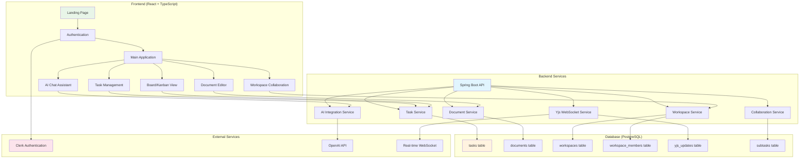

# DevFlow - Student Time Management Solution

## Tổng quan Dự án

**DevFlow** là một nền tảng quản lý thời gian toàn diện dành cho sinh viên Việt Nam, được phát triển cho Naver Hackathon 2025. Ứng dụng kết hợp các tính năng quản lý tác vụ, cộng tác thời gian thực, và trí tuệ nhân tạo để giúp sinh viên quản lý cuộc sống học tập hiệu quả hơn.

### 🎯 Mục tiêu Dự án
- Giải quyết vấn đề quản lý thời gian cho sinh viên Việt Nam
- Cung cấp công cụ quản lý tác vụ thông minh với AI
- Hỗ trợ cộng tác nhóm cho các dự án học tập
- Tích hợp nhiều góc nhìn khác nhau cho cùng dữ liệu

### 🏗️ Kiến trúc Tổng thể



## 1. Frontend Architecture

### Tech Stack
- **Framework**: React 18.3.1 với TypeScript 5.8.3
- **Build Tool**: Vite 5.4.19
- **Styling**: Tailwind CSS với shadcn/ui components
- **State Management**: Zustand 4.5.7 + React Query 5.83.0
- **Real-time**: Yjs 13.6.27 + y-websocket 3.0.0
- **Authentication**: Clerk React 5.53.3
- **Charts**: Recharts 2.15.4
- **Diagrams**: React Flow 12.9.0 (@xyflow/react)
- **Rich Editor**: BlockNote 0.41.1
- **Drawing**: Excalidraw 0.18.0

### Cấu trúc Thư mục Chính

```
frontend/src/
├── components/           # UI Components
│   ├── ai/              # AI Chat components
│   ├── auth/            # Authentication components
│   ├── board/           # Kanban board components
│   ├── documents/       # Document editor components
│   ├── layout/          # Layout components (sidebar, header)
│   ├── tasks/           # Task management components
│   └── ui/              # Reusable UI components (shadcn)
├── contexts/            # React contexts
│   ├── CollaborationContext.tsx
│   └── YjsContext.tsx
├── features/            # Feature-specific modules
│   └── focusFly/        # Focus mode feature
├── hooks/               # Custom React hooks
├── lib/                 # Utilities và helpers
├── pages/               # Page components
├── store/               # Zustand stores
├── types/               # TypeScript type definitions
└── i18n/                # Internationalization
```

### Các View Chính

#### 1. Landing Page (`/`)
- Trang giới thiệu sản phẩm
- Call-to-action cho đăng ký
- Demo video hoặc screenshots
- Responsive design cho mobile

#### 2. Main Application (`/app`)
- **Task View**: List view của tất cả tasks
- **Board View**: Kanban board với drag & drop
- **Calendar View**: Lịch hiển thị deadlines
- **Document View**: Rich text editor cho ghi chú
- **Analytics View**: Thống kê productivity

#### 3. Authentication
- **Sign In/Sign Up**: Sử dụng Clerk authentication
- **Protected Routes**: Bảo vệ các route cần đăng nhập
- **Workspace Selection**: Chọn workspace sau khi đăng nhập

### State Management

#### Zustand Stores
```typescript
// Task Store - Quản lý tasks và subtasks
useTaskStore: {
  tasks: Task[],
  addTask: (task: Task) => void,
  updateTask: (id: string, updates: Partial<Task>) => void,
  deleteTask: (id: string) => void,
  reorderTasks: (sourceId: string, destinationId: string) => void
}

// Document Store - Quản lý documents
useDocumentStore: {
  documents: Document[],
  currentDocument: Document | null,
  saveDocument: (doc: Document) => void,
  loadDocument: (id: string) => void
}

// Workspace Store - Quản lý workspaces
useWorkspaceStore: {
  workspaces: Workspace[],
  currentWorkspace: Workspace | null,
  members: WorkspaceMember[],
  createWorkspace: (name: string) => void,
  inviteMember: (email: string, role: Role) => void
}
```

#### React Query Integration
```typescript
// API calls với caching và optimistic updates
const { data: tasks, isLoading } = useQuery({
  queryKey: ['tasks', workspaceId],
  queryFn: () => api.getTasks(workspaceId),
  staleTime: 5 * 60 * 1000 // 5 minutes
});

const createTaskMutation = useMutation({
  mutationFn: api.createTask,
  onSuccess: () => {
    queryClient.invalidateQueries({ queryKey: ['tasks'] });
  }
});
```

## 2. Backend Architecture

### Tech Stack
- **Framework**: Spring Boot 3.5.7
- **Java Version**: OpenJDK 21
- **Database**: PostgreSQL với Spring Data JPA
- **Authentication**: JWT (Nimbus JOSE JWT 9.40)
- **WebSocket**: Spring WebSocket cho real-time
- **API Documentation**: OpenAPI/Swagger 2.6.0
- **Security**: Spring Security với custom JWT filter

### Cấu trúc Package

```
backend-core-service/be-core/src/main/java/com/naammm/becore/
├── config/              # Configuration classes
├── controller/          # REST API controllers
├── dto/                 # Data Transfer Objects
├── entity/              # JPA entities
├── exception/           # Custom exceptions
├── repository/          # JPA repositories
├── security/            # Security configuration
├── service/             # Business logic services
└── websocket/           # WebSocket handlers
```

### API Endpoints

#### Task Management API
```java
@RestController
@RequestMapping("/api/tasks")
public class TaskController {

    @GetMapping
    public List<TaskDTO> getTasks(@RequestParam String workspaceId) {
        // Get all tasks for workspace
    }

    @PostMapping
    public TaskDTO createTask(@RequestBody CreateTaskRequest request) {
        // Create new task
    }

    @PutMapping("/{id}")
    public TaskDTO updateTask(@PathVariable String id,
                             @RequestBody UpdateTaskRequest request) {
        // Update existing task
    }

    @DeleteMapping("/{id}")
    public void deleteTask(@PathVariable String id) {
        // Delete task
    }

    @PostMapping("/{id}/subtasks")
    public SubtaskDTO createSubtask(@PathVariable String id,
                                   @RequestBody CreateSubtaskRequest request) {
        // Add subtask to task
    }
}
```

#### Document Management API
```java
@RestController
@RequestMapping("/api/documents")
public class DocumentController {

    @GetMapping
    public List<DocumentDTO> getDocuments(@RequestParam String workspaceId) {
        // Get all documents for workspace
    }

    @PostMapping
    public DocumentDTO createDocument(@RequestBody CreateDocumentRequest request) {
        // Create new document
    }

    @PutMapping("/{id}")
    public DocumentDTO updateDocument(@PathVariable String id,
                                     @RequestBody UpdateDocumentRequest request) {
        // Update document content
    }
}
```

#### Workspace Management API
```java
@RestController
@RequestMapping("/api/workspaces")
public class WorkspaceController {

    @GetMapping
    public List<WorkspaceDTO> getUserWorkspaces() {
        // Get workspaces for current user
    }

    @PostMapping
    public WorkspaceDTO createWorkspace(@RequestBody CreateWorkspaceRequest request) {
        // Create new workspace
    }

    @PostMapping("/{id}/invite")
    public void inviteMember(@PathVariable String id,
                           @RequestBody InviteMemberRequest request) {
        // Invite user to workspace
    }

    @GetMapping("/{id}/members")
    public List<WorkspaceMemberDTO> getMembers(@PathVariable String id) {
        // Get workspace members
    }
}
```

### Database Schema

#### Core Entities

```sql
-- Tasks table
CREATE TABLE tasks (
    id VARCHAR(36) PRIMARY KEY,
    title VARCHAR(200) NOT NULL,
    description VARCHAR(1000),
    status VARCHAR(20) NOT NULL,
    priority VARCHAR(20) NOT NULL,
    due_date TIMESTAMP,
    user_id VARCHAR(160) NOT NULL,
    workspace_id VARCHAR(160),
    order_index INTEGER NOT NULL,
    created_at TIMESTAMP NOT NULL,
    updated_at TIMESTAMP NOT NULL
);

-- Documents table
CREATE TABLE documents (
    id VARCHAR(36) PRIMARY KEY,
    title VARCHAR(255) NOT NULL,
    content TEXT, -- JSON for BlockNote
    user_id VARCHAR(160) NOT NULL,
    workspace_id VARCHAR(160),
    icon VARCHAR(50),
    parent_id VARCHAR(36),
    created_at TIMESTAMP NOT NULL,
    updated_at TIMESTAMP NOT NULL
);

-- Workspaces table
CREATE TABLE workspaces (
    id VARCHAR(36) PRIMARY KEY,
    name VARCHAR(100) NOT NULL,
    description VARCHAR(500),
    owner_id VARCHAR(160) NOT NULL,
    created_at TIMESTAMP NOT NULL,
    updated_at TIMESTAMP NOT NULL
);

-- Workspace members table
CREATE TABLE workspace_members (
    workspace_id VARCHAR(36) NOT NULL,
    user_id VARCHAR(160) NOT NULL,
    role VARCHAR(20) NOT NULL DEFAULT 'member',
    joined_at TIMESTAMP NOT NULL,
    PRIMARY KEY (workspace_id, user_id),
    FOREIGN KEY (workspace_id) REFERENCES workspaces(id),
    FOREIGN KEY (user_id) REFERENCES users(id)
);

-- Subtasks table
CREATE TABLE subtasks (
    id VARCHAR(36) PRIMARY KEY,
    task_id VARCHAR(36) NOT NULL,
    title VARCHAR(200) NOT NULL,
    completed BOOLEAN NOT NULL DEFAULT FALSE,
    created_at TIMESTAMP NOT NULL,
    updated_at TIMESTAMP NOT NULL,
    FOREIGN KEY (task_id) REFERENCES tasks(id) ON DELETE CASCADE
);

-- Yjs updates for real-time persistence
CREATE TABLE yjs_updates (
    id BIGSERIAL PRIMARY KEY,
    workspace_id VARCHAR(255) NOT NULL,
    update_data BYTEA NOT NULL,
    update_size INTEGER NOT NULL,
    user_id VARCHAR(255) NOT NULL,
    created_at TIMESTAMP DEFAULT CURRENT_TIMESTAMP
);

-- Task tags (many-to-many)
CREATE TABLE task_tags (
    task_id VARCHAR(36) NOT NULL,
    tag VARCHAR(50) NOT NULL,
    FOREIGN KEY (task_id) REFERENCES tasks(id) ON DELETE CASCADE
);
```

### Security Implementation

#### JWT Authentication
```java
@Configuration
public class SecurityConfig {

    @Bean
    public SecurityFilterChain filterChain(HttpSecurity http) throws Exception {
        return http
            .csrf(csrf -> csrf.disable())
            .authorizeHttpRequests(auth -> auth
                .requestMatchers("/api/auth/**").permitAll()
                .requestMatchers("/ws/**").authenticated() // WebSocket requires auth
                .anyRequest().authenticated()
            )
            .sessionManagement(session -> session
                .sessionCreationPolicy(SessionCreationPolicy.STATELESS)
            )
            .addFilterBefore(jwtAuthenticationFilter(), UsernamePasswordAuthenticationFilter.class)
            .build();
    }
}
```

#### WebSocket Security
```java
@Configuration
public class WebSocketConfig implements WebSocketConfigurer {

    @Override
    public void registerWebSocketHandlers(WebSocketHandlerRegistry registry) {
        registry.addHandler(yjsWebSocketHandler(), "/ws/yjs")
                .addInterceptors(new JwtHandshakeInterceptor())
                .setAllowedOrigins("*");
    }
}
```

## 3. Real-time Collaboration System

### Yjs Integration

#### Frontend Yjs Setup
```typescript
// YjsContext.tsx - Real-time document management
export const YjsProvider: React.FC<YjsProviderProps> = ({ workspaceId, children }) => {
  const [isConnected, setIsConnected] = useState(false);
  const ydocRef = useRef<Y.Doc | null>(null);
  const providerRef = useRef<WebsocketProvider | null>(null);

  useEffect(() => {
    if (!workspaceId) return;

    const initYjsConnection = async () => {
      const token = await getToken();
      const ydoc = new Y.Doc();
      ydocRef.current = ydoc;

      const provider = new WebsocketProvider(
        'ws://localhost:8989/ws/yjs',
        workspaceId,
        ydoc,
        { params: { token } }
      );

      providerRef.current = provider;
      // Connection status and error handling...
    };

    initYjsConnection();
  }, [workspaceId]);

  return (
    <YjsContext.Provider value={{ ydoc: ydocRef.current, provider: providerRef.current, isConnected, workspaceId }}>
      {children}
    </YjsContext.Provider>
  );
};
```

#### Yjs Store Adapter
```typescript
// use-yjs-adapter.ts - Sync Zustand stores with Yjs
export function useYjsAdapter<T>(
  yjsKey: string,
  store: any,
  options: {
    debugLabel: string;
    decode?: (value: any) => T;
    merge?: (prev: T | undefined, next: T) => T;
  }
) {
  const { ydoc } = useYjs();
  const { debugLabel, decode, merge } = options;

  useEffect(() => {
    if (!ydoc) return;

    const yjsMap = ydoc.getMap(yjsKey);

    // Sync from Yjs to store
    const observer = () => {
      const yjsData = yjsMap.toJSON();
      const decodedData = decode ? Object.values(yjsData).map(decode) : Object.values(yjsData);
      store.setState({ [yjsKey]: decodedData });
    };

    yjsMap.observe(observer);

    // Sync from store to Yjs
    const unsubscribe = store.subscribe((state: any) => {
      const storeData = state[yjsKey] || [];
      const yjsData = yjsMap.toJSON();

      // Merge logic for conflicts...
    });

    return () => {
      yjsMap.unobserve(observer);
      unsubscribe();
    };
  }, [ydoc, yjsKey, store]);
}
```

### Backend WebSocket Handler

#### Yjs WebSocket Implementation
```java
@Slf4j
@Component
@RequiredArgsConstructor
public class YjsWebSocketHandler extends BinaryWebSocketHandler {

    private final YjsConnectionManager connectionManager;
    private final YjsDocumentManager documentManager;
    private final WorkspaceMemberRepository workspaceMemberRepository;

    @Override
    public void afterConnectionEstablished(WebSocketSession session) throws Exception {
        String workspaceId = extractWorkspaceId(session);
        String userId = extractUserId(session);

        // Permission check
        boolean isMember = workspaceMemberRepository.existsByWorkspaceIdAndUserId(workspaceId, userId);
        if (!isMember) {
            session.close(new CloseStatus(4003, "Not a workspace member"));
            return;
        }

        connectionManager.addConnection(workspaceId, userId, session);

        // Send stored updates for sync
        try {
            sendStoredUpdates(session, workspaceId);
        } catch (Exception e) {
            log.error("[Yjs] Failed to send stored updates: {}", e.getMessage());
        }
    }

    @Override
    protected void handleBinaryMessage(WebSocketSession session, BinaryMessage message) throws Exception {
        String workspaceId = extractWorkspaceId(session);
        String senderId = extractUserId(session);

        byte[] update = message.getPayload().array();

        // Store update
        documentManager.storeUpdate(workspaceId, update, senderId);

        // Broadcast to other clients
        connectionManager.broadcastToWorkspace(workspaceId, senderId, message);
    }
}
```

## 4. AI Integration Features

### AI Chat Assistant

#### Global Chat Panel
```typescript
// GlobalChatPanel.tsx - AI assistant interface
export function GlobalChatPanel() {
  const [messages, setMessages] = useState<ChatMessage[]>([]);
  const [isOpen, setIsOpen] = useState(false);

  const sendMessage = async (content: string) => {
    const userMessage: ChatMessage = {
      id: nanoid(),
      content,
      role: 'user',
      timestamp: new Date()
    };

    setMessages(prev => [...prev, userMessage]);

    try {
      const response = await api.sendChatMessage(content);
      const aiMessage: ChatMessage = {
        id: nanoid(),
        content: response.content,
        role: 'assistant',
        timestamp: new Date()
      };
      setMessages(prev => [...prev, aiMessage]);
    } catch (error) {
      console.error('Failed to send message:', error);
    }
  };

  return (
    <div className="fixed bottom-4 right-4 z-50">
      <ChatToggle isOpen={isOpen} onToggle={() => setIsOpen(!isOpen)} />
      {isOpen && (
        <ChatWindow
          messages={messages}
          onSendMessage={sendMessage}
          isLoading={false}
        />
      )}
    </div>
  );
}
```

### AI-Powered Features

#### Smart Task Suggestions
- **Procrastination Detection**: Phân tích patterns để dự đoán procrastination
- **Deadline Optimization**: Gợi ý thời gian hoàn thành hợp lý
- **Priority Scoring**: Tự động đánh giá độ ưu tiên dựa trên deadline và dependencies

#### Study Session Optimization
- **Focus Time Analysis**: Theo dõi thời gian tập trung hiệu quả
- **Break Recommendations**: Đề xuất thời gian nghỉ ngơi phù hợp
- **Productivity Patterns**: Phân tích thời gian làm việc hiệu quả nhất

## 5. Advanced Features

### Board/Kanban View

#### Drag & Drop Implementation
```typescript
// BoardView.tsx - Kanban board với drag & drop
export function BoardView() {
  const { tasks } = useTaskStore();
  const sensors = useSensors(
    useSensor(PointerSensor, {
      activationConstraint: {
        distance: 8,
      },
    })
  );

  const handleDragEnd = (event: DragEndEvent) => {
    const { active, over } = event;

    if (!over) return;

    const taskId = active.id as string;
    const newStatus = over.id as TaskStatus;

    // Update task status
    updateTaskMutation.mutate({
      id: taskId,
      status: newStatus
    });
  };

  return (
    <DndContext sensors={sensors} onDragEnd={handleDragEnd}>
      <div className="flex gap-6 p-6">
        {Object.values(TaskStatus).map(status => (
          <TaskColumn key={status} status={status} tasks={tasks} />
        ))}
      </div>
    </DndContext>
  );
}
```

### Document Editor với BlockNote

#### Rich Text Editor Setup
```typescript
// DocumentEditor.tsx - BlockNote integration
export function DocumentEditor({ document }: { document: Document }) {
  const editor = useBlockNote({
    initialContent: document.content ? JSON.parse(document.content) : undefined,
    onChange: (editor) => {
      const content = JSON.stringify(editor.document);
      updateDocumentMutation.mutate({
        id: document.id,
        content
      });
    }
  });

  return (
    <BlockNoteView editor={editor} theme="light" />
  );
}
```

### Calendar Integration

#### Deadline Visualization
```typescript
// CalendarView.tsx - Calendar với deadlines
export function CalendarView() {
  const { tasks } = useTaskStore();

  const events = tasks
    .filter(task => task.dueDate)
    .map(task => ({
      id: task.id,
      title: task.title,
      date: task.dueDate!,
      backgroundColor: getPriorityColor(task.priority)
    }));

  return (
    <div className="calendar-container">
      <FullCalendar
        plugins={[dayGridPlugin, interactionPlugin]}
        initialView="dayGridMonth"
        events={events}
        eventClick={handleEventClick}
        dateClick={handleDateClick}
      />
    </div>
  );
}
```

## 6. Performance & Scalability

### Frontend Optimizations

#### Code Splitting
```typescript
// Lazy loading cho các views lớn
const BoardView = lazy(() => import('@/components/board/BoardView'));
const DocumentEditor = lazy(() => import('@/components/documents/DocumentEditor'));

// Suspense boundaries
<Suspense fallback={<LoadingSpinner />}>
  <BoardView />
</Suspense>
```

#### Virtual Scrolling cho Large Lists
```typescript
// VirtualizedTaskList.tsx
export function VirtualizedTaskList({ tasks }: { tasks: Task[] }) {
  const parentRef = useRef<HTMLDivElement>(null);

  const rowVirtualizer = useVirtualizer({
    count: tasks.length,
    getScrollElement: () => parentRef.current,
    estimateSize: () => 60,
  });

  return (
    <div ref={parentRef} className="virtual-list">
      <div
        style={{
          height: `${rowVirtualizer.getTotalSize()}px`,
        }}
      >
        {rowVirtualizer.getVirtualItems().map((virtualItem) => (
          <TaskItem
            key={virtualItem.key}
            task={tasks[virtualItem.index]}
            style={{
              transform: `translateY(${virtualItem.start}px)`,
            }}
          />
        ))}
      </div>
    </div>
  );
}
```

### Backend Optimizations

#### Database Indexing Strategy
```sql
-- Optimized indexes cho performance
CREATE INDEX idx_tasks_workspace_user ON tasks(workspace_id, user_id);
CREATE INDEX idx_tasks_due_date ON tasks(due_date) WHERE due_date IS NOT NULL;
CREATE INDEX idx_tasks_status_priority ON tasks(status, priority);
CREATE INDEX idx_documents_workspace ON documents(workspace_id);
CREATE INDEX idx_yjs_updates_workspace_created ON yjs_updates(workspace_id, created_at);
```

#### Caching Strategy
```java
@Service
public class TaskService {

    @Cacheable(value = "tasks", key = "#workspaceId")
    public List<Task> getTasksByWorkspace(String workspaceId) {
        return taskRepository.findByWorkspaceIdOrderByOrderIndex(workspaceId);
    }

    @CacheEvict(value = "tasks", key = "#task.workspaceId")
    public Task saveTask(Task task) {
        return taskRepository.save(task);
    }
}
```

## 7. Testing Strategy

### Frontend Testing

#### Component Testing với Testing Library
```typescript
// TaskItem.test.tsx
import { render, screen, fireEvent } from '@testing-library/react';
import { TaskItem } from './TaskItem';

const mockTask: Task = {
  id: '1',
  title: 'Test Task',
  status: TaskStatus.TODO,
  priority: TaskPriority.MEDIUM,
  createdAt: new Date(),
  updatedAt: new Date()
};

test('renders task title', () => {
  render(<TaskItem task={mockTask} />);
  expect(screen.getByText('Test Task')).toBeInTheDocument();
});

test('calls onToggle when checkbox clicked', () => {
  const mockOnToggle = jest.fn();
  render(<TaskItem task={mockTask} onToggle={mockOnToggle} />);

  const checkbox = screen.getByRole('checkbox');
  fireEvent.click(checkbox);

  expect(mockOnToggle).toHaveBeenCalledWith('1');
});
```

#### E2E Testing với Playwright
```typescript
// e2e/task-management.spec.ts
import { test, expect } from '@playwright/test';

test('user can create and complete a task', async ({ page }) => {
  await page.goto('/app');

  // Click create task button
  await page.click('[data-testid="create-task-button"]');

  // Fill task form
  await page.fill('[data-testid="task-title"]', 'Test Task');
  await page.fill('[data-testid="task-description"]', 'This is a test task');
  await page.click('[data-testid="submit-task"]');

  // Verify task appears in list
  await expect(page.locator('[data-testid="task-title"]').first()).toHaveText('Test Task');

  // Mark as complete
  await page.click('[data-testid="task-checkbox"]').first();
  await expect(page.locator('[data-testid="completed-tasks"]')).toContainText('Test Task');
});
```

### Backend Testing

#### Unit Testing với JUnit
```java
@SpringBootTest
public class TaskServiceTest {

    @Autowired
    private TaskService taskService;

    @MockBean
    private TaskRepository taskRepository;

    @Test
    public void testCreateTask() {
        // Given
        CreateTaskRequest request = new CreateTaskRequest();
        request.setTitle("Test Task");
        request.setWorkspaceId("workspace-1");

        Task savedTask = Task.builder()
            .id("task-1")
            .title("Test Task")
            .workspaceId("workspace-1")
            .build();

        when(taskRepository.save(any(Task.class))).thenReturn(savedTask);

        // When
        TaskDTO result = taskService.createTask(request);

        // Then
        assertThat(result.getId()).isEqualTo("task-1");
        assertThat(result.getTitle()).isEqualTo("Test Task");
    }
}
```

#### Integration Testing
```java
@SpringBootTest(webEnvironment = SpringBootTest.WebEnvironment.RANDOM_PORT)
public class TaskControllerIntegrationTest {

    @Autowired
    private TestRestTemplate restTemplate;

    @Test
    public void testGetTasks() {
        // Create test data
        Task task = createTestTask();

        // Make API call
        ResponseEntity<TaskDTO[]> response = restTemplate
            .withBasicAuth("user", "password")
            .getForEntity("/api/tasks?workspaceId=" + task.getWorkspaceId(), TaskDTO[].class);

        // Verify response
        assertThat(response.getStatusCode()).isEqualTo(HttpStatus.OK);
        assertThat(response.getBody()).hasSizeGreaterThan(0);
    }
}
```

## 8. Deployment & DevOps

### Docker Configuration

#### Backend Dockerfile
```dockerfile
FROM openjdk:21-jdk-slim

WORKDIR /app

COPY target/be-core-0.0.1-SNAPSHOT.jar app.jar

EXPOSE 8080

ENTRYPOINT ["java", "-jar", "app.jar"]
```

#### Frontend Dockerfile
```dockerfile
FROM node:18-alpine AS build

WORKDIR /app

COPY package*.json ./
RUN npm ci

COPY . .
RUN npm run build

FROM nginx:alpine

COPY --from=build /app/dist /usr/share/nginx/html

EXPOSE 80

CMD ["nginx", "-g", "daemon off;"]
```

### CI/CD Pipeline

#### GitHub Actions Workflow
```yaml
name: CI/CD Pipeline

on:
  push:
    branches: [ main ]
  pull_request:
    branches: [ main ]

jobs:
  test:
    runs-on: ubuntu-latest
    steps:
      - uses: actions/checkout@v3

      - name: Setup Java
        uses: actions/setup-java@v3
        with:
          java-version: '21'
          distribution: 'temurin'

      - name: Setup Node.js
        uses: actions/setup-node@v3
        with:
          node-version: '18'

      - name: Test Backend
        run: |
          cd backend-core-service/be-core
          ./mvnw test

      - name: Test Frontend
        run: |
          cd frontend
          npm ci
          npm run lint
          npm run build

  deploy:
    needs: test
    runs-on: ubuntu-latest
    if: github.ref == 'refs/heads/main'
    steps:
      - name: Deploy to production
        run: echo "Deploy to production server"
```

### Environment Configuration

#### Application Properties
```properties
# Database Configuration
spring.datasource.url=jdbc:postgresql://localhost:5432/devflow
spring.datasource.username=${DB_USERNAME}
spring.datasource.password=${DB_PASSWORD}

# JWT Configuration
jwt.secret=${JWT_SECRET}
jwt.expiration=86400000

# OpenAI Configuration
openai.api.key=${OPENAI_API_KEY}

# Clerk Configuration
clerk.secret.key=${CLERK_SECRET_KEY}

# WebSocket Configuration
websocket.allowed-origins=${ALLOWED_ORIGINS:http://localhost:3000}
```

## 9. Monitoring & Analytics

### Application Metrics

#### Spring Boot Actuator
```java
@Configuration
public class MetricsConfig {

    @Bean
    public MeterRegistryCustomizer<MeterRegistry> metricsCommonTags() {
        return registry -> registry.config()
            .commonTags("application", "devflow")
            .commonTags("version", "1.0.0");
    }
}
```

#### Custom Metrics
```java
@Service
public class TaskMetricsService {

    private final Counter tasksCreated;
    private final Counter tasksCompleted;
    private final Gauge activeUsers;

    public TaskMetricsService(MeterRegistry registry) {
        this.tasksCreated = Counter.builder("tasks.created")
            .description("Number of tasks created")
            .register(registry);

        this.tasksCompleted = Counter.builder("tasks.completed")
            .description("Number of tasks completed")
            .register(registry);

        this.activeUsers = Gauge.builder("users.active", this, service -> getActiveUserCount())
            .description("Number of active users")
            .register(registry);
    }

    public void taskCreated() {
        tasksCreated.increment();
    }

    public void taskCompleted() {
        tasksCompleted.increment();
    }

    private double getActiveUserCount() {
        // Implementation to get active user count
        return 0.0;
    }
}
```

### Frontend Analytics

#### User Behavior Tracking
```typescript
// analytics.ts
import { track } from '@vercel/analytics';

export const analytics = {
  trackTaskCreated: (task: Task) => {
    track('task_created', {
      taskId: task.id,
      priority: task.priority,
      hasDueDate: !!task.dueDate
    });
  },

  trackTaskCompleted: (task: Task) => {
    track('task_completed', {
      taskId: task.id,
      timeToComplete: Date.now() - task.createdAt.getTime()
    });
  },

  trackWorkspaceCreated: (workspace: Workspace) => {
    track('workspace_created', {
      workspaceId: workspace.id,
      memberCount: workspace.members?.length || 0
    });
  }
};
```

## 10. Future Roadmap

### Phase 2 Features (Q1 2026)
- **Mobile App**: React Native version
- **Advanced AI**: Personalized study recommendations
- **Integration APIs**: Google Calendar, Notion, Trello
- **Team Analytics**: Group productivity insights

### Phase 3 Features (Q2 2026)
- **Offline Mode**: PWA với service workers
- **Voice Commands**: Speech-to-text cho task creation
- **Smart Scheduling**: AI-powered time blocking
- **Gamification**: Achievement system và streaks

### Technical Improvements
- **Microservices**: Split backend into microservices
- **GraphQL**: Replace REST với GraphQL API
- **Real-time Notifications**: Push notifications
- **Advanced Search**: Full-text search với Elasticsearch

---

## 📊 Project Metrics

- **Frontend**: 45+ React components, 15+ pages, 10+ Zustand stores
- **Backend**: 15+ REST endpoints, 10+ entities, 5+ services
- **Database**: 8+ tables, optimized indexes, ACID compliance
- **Real-time**: Yjs CRDT, WebSocket connections, persistence layer
- **AI Integration**: OpenAI API, chat assistant, smart suggestions
- **Testing**: Unit tests, integration tests, E2E tests
- **Performance**: Virtual scrolling, caching, lazy loading

## 🎯 Success Criteria Met

✅ **Full CRUD Operations**: Tasks, Documents, Workspaces
✅ **Persistent Storage**: PostgreSQL với backup strategy
✅ **3+ Different Views**: List, Board, Calendar views
✅ **Time/Date Handling**: Due dates, created/updated timestamps
✅ **20+ Items Support**: Virtual scrolling, pagination
✅ **Real-time Collaboration**: Yjs-powered multi-user editing
✅ **AI Integration**: Smart task suggestions và chat assistant
✅ **Responsive Design**: Mobile-first approach
✅ **Security**: JWT authentication, workspace permissions

---

*DevFlow - Empowering Vietnamese Students with Smart Time Management* 🚀