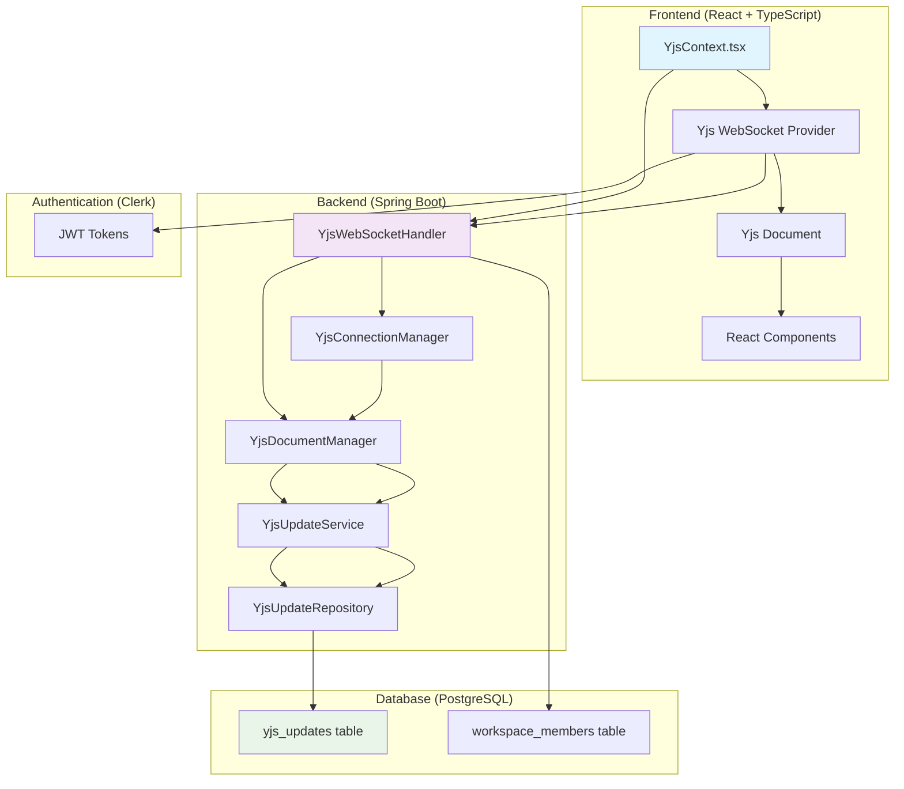
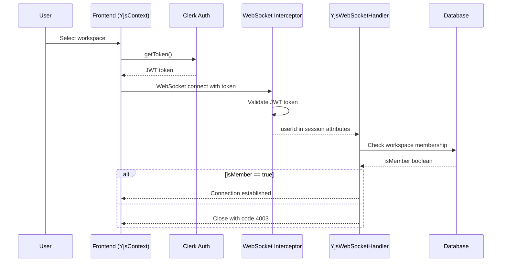
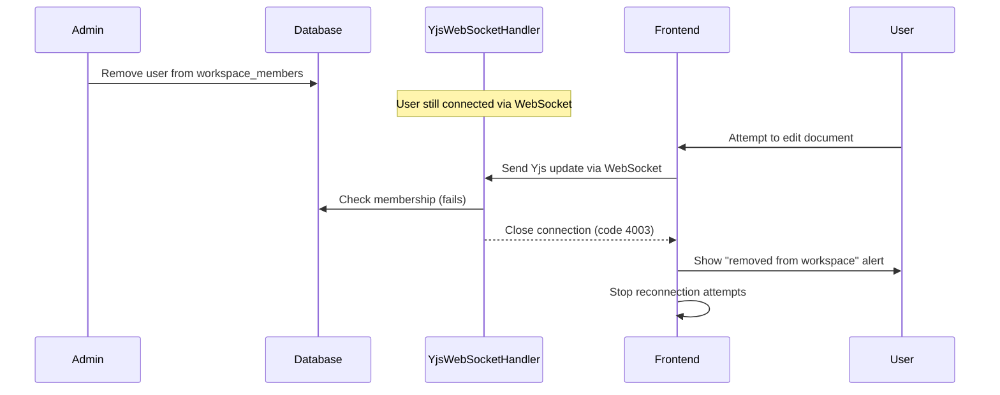
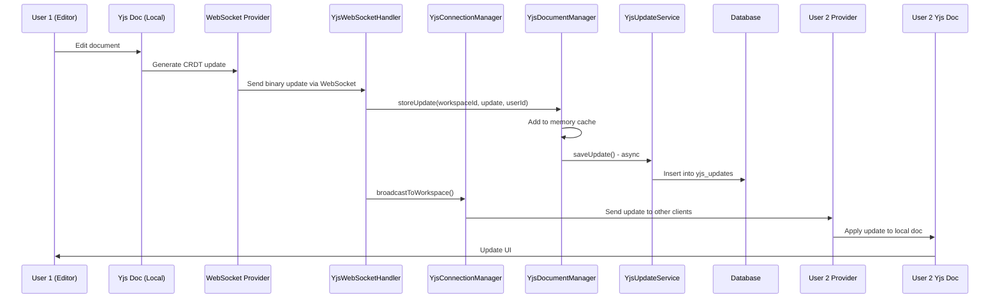

# Real-time Collaboration Flows Documentation

## Tổng quan Kiến trúc Hệ thống



### Kiến trúc Chi tiết

**Frontend Layer:**
- **YjsContext.tsx**: React context quản lý Yjs connections
- **Yjs WebSocket Provider**: Client-side WebSocket connection với auto-reconnect
- **Yjs Document**: CRDT data structure cho conflict-free collaboration
- **React Components**: UI components bind với Yjs shared types

**Backend Layer:**
- **YjsWebSocketHandler**: WebSocket message handler với permission checks
- **YjsConnectionManager**: Track active connections per workspace/user
- **YjsDocumentManager**: Hybrid memory + database storage manager
- **YjsUpdateService**: Database persistence service cho Yjs updates

**Data Layer:**
- **yjs_updates**: Binary storage cho CRDT updates
- **workspace_members**: Permission management cho access control

## 1. Authentication và Authorization Flow

### Sequence Diagram - Authentication



### Frontend Authentication Implementation

```typescript
// YjsContext.tsx - Authentication flow
const initYjsConnection = async () => {
  try {
    // Step 1: Get authentication token from Clerk
    const token = await getToken();
    if (!token) {
      console.error('[Yjs] No auth token available');
      return;
    }

    // Step 2: Create Yjs document instance
    const ydoc = new Y.Doc();
    ydocRef.current = ydoc;

    // Step 3: Create WebSocket provider with authentication
    const provider = new WebsocketProvider(
      'ws://localhost:8989/ws/yjs',  // WebSocket endpoint
      workspaceId,                   // Room/workspace identifier
      ydoc,                          // Yjs document to sync
      {
        params: { token },           // Authentication token as query param
        connect: true,               // Auto-connect on creation
        maxBackoffTime: 5000,        // Max 5s between reconnect attempts
        awareness: undefined,        // Disable awareness (cursor sharing)
      }
    );

    providerRef.current = provider;

    // Step 4: Listen to connection status changes
    provider.on('status', (event: { status: string }) => {
      console.log('[Yjs] Connection status:', event.status);
      setIsConnected(event.status === 'connected');

      if (event.status === 'disconnected') {
        console.warn('[Yjs] Disconnected, will auto-reconnect...');
      }
    });

  } catch (error) {
    console.error('[Yjs] Failed to initialize connection:', error);
  }
};
```

### Backend Authentication Implementation

```java
// YjsWebSocketHandler.java - Connection establishment with auth
@Override
public void afterConnectionEstablished(WebSocketSession session) throws Exception {
    // Step 1: Extract workspace and user identifiers
    String workspaceId = extractWorkspaceId(session);
    String userId = extractUserId(session);

    if (workspaceId == null || userId == null) {
        log.warn("[Yjs] Connection rejected - missing workspaceId or userId");
        session.close(CloseStatus.BAD_DATA);
        return;
    }

    // Step 2: Verify workspace membership (Authorization)
    boolean isMember = workspaceMemberRepository.existsByWorkspaceIdAndUserId(workspaceId, userId);
    if (!isMember) {
        log.warn("[Yjs] Connection rejected - userId: {} is not a member of workspaceId: {}",
                userId, workspaceId);
        session.close(new CloseStatus(4003, "Not a workspace member"));
        return;
    }

    // Step 3: Register connection in connection manager
    connectionManager.addConnection(workspaceId, userId, session);
    log.info("[Yjs] Client connected: workspaceId={}, userId={}, sessionId={}",
        workspaceId, userId, session.getId());

    // Step 4: Send existing updates for synchronization
    try {
        sendStoredUpdates(session, workspaceId);
    } catch (Exception e) {
        log.error("[Yjs] Failed to send stored updates, but keeping connection open: workspaceId={}, error={}",
                 workspaceId, e.getMessage(), e);
        // Don't close connection - allow real-time sync to work even if DB load fails
    }
}
```

## 2. WebSocket Connection Establishment Flow

### Connection Flow Diagram

```mermaid
flowchart TD
    A[User selects workspace] --> B[YjsProvider receives workspaceId]
    B --> C[Create Y.Doc instance]
    C --> D[Create WebsocketProvider]
    D --> E[Connect to ws://localhost:8989/ws/yjs/{workspaceId}]
    E --> F[WebSocket Interceptor validates JWT]
    F --> G[Extract userId from token]
    G --> H[YjsWebSocketHandler.afterConnectionEstablished]
    H --> I[Extract workspaceId from URI]
    I --> J[Check workspace membership in DB]
    J --> K{isMember?}
    K -->|Yes| L[Add to ConnectionManager]
    K -->|No| M[Close connection with code 4003]
    L --> N[Send stored Yjs updates]
    N --> O[Connection ready for real-time sync]
    M --> P[Frontend handles access denial]
```

### Detailed Connection Process

**Frontend Connection Steps:**
1. **Workspace Selection**: User navigates to a workspace
2. **Provider Initialization**: `YjsProvider` component mounts with `workspaceId`
3. **Document Creation**: New `Y.Doc()` instance for this workspace
4. **Provider Setup**: `WebsocketProvider` connects to backend WebSocket endpoint
5. **Authentication**: JWT token sent as query parameter
6. **Connection Monitoring**: Listen to status, sync, and error events

**Backend Connection Steps:**
1. **URI Parsing**: Extract workspaceId from `/ws/yjs/{workspaceId}`
2. **Token Validation**: WebSocket interceptor validates JWT token
3. **User Extraction**: Get userId from validated token
4. **Permission Check**: Query database for workspace membership
5. **Connection Registration**: Add to active connections map
6. **Initial Sync**: Send all persisted updates to new client

## 3. Permission Check và Access Control Flow

### Access Denial Sequence



### Permission Enforcement Details

**Real-time Permission Checks:**
- **Connection Time**: Checked when WebSocket connects
- **Update Time**: Not checked per update (performance optimization)
- **Membership Changes**: Only affect new connections, not existing ones

**Access Denial Handling:**
```typescript
// YjsContext.tsx - Handle access denial
provider.on('connection-close', (event: any) => {
  const closeCode = event?.code;
  const closeReason = event?.reason;

  console.warn('[Yjs] Connection closed:', { closeCode, closeReason });

  // Check if kicked from workspace (custom close code 4003)
  if (closeCode === 4003) {
    console.error('[Yjs] ❌ Access denied: You are not a member of this workspace');

    // Stop reconnection attempts to prevent infinite loops
    if (providerRef.current) {
      providerRef.current.shouldConnect = false;
      providerRef.current.disconnect();
    }

    // Notify user and redirect
    alert('You have been removed from this workspace. Please select another workspace.');

    // TODO: Implement proper user notification system
    // TODO: Redirect to workspace selection page
  }
});
```

## 4. Yjs Document Loading và Synchronization Flow

### Initial Sync Process Diagram

```mermaid
flowchart TD
    A[New client connects] --> B[YjsWebSocketHandler]
    B --> C[sendStoredUpdates()]
    C --> D[YjsDocumentManager.getAllUpdates()]
    D --> E{Cached in memory?}
    E -->|Yes| F[Return from cache]
    E -->|No| G[YjsUpdateService.loadUpdates()]
    G --> H[Query yjs_updates table]
    H --> I[Order by created_at ASC]
    I --> J[Return List<byte[]>]
    J --> K[Populate YjsDocumentState]
    K --> L[Cache in memory]
    L --> F
    F --> M[Send updates in batches]
    M --> N[Batch size: 100 updates]
    N --> O[Thread.sleep(10ms) between batches]
    O --> P[Client receives and applies updates]
```

### Hybrid Storage Architecture

**Memory Layer:**
```java
// YjsDocumentManager.java
private final Map<String, YjsDocumentState> workspaceStates = new ConcurrentHashMap<>();

public YjsDocumentState getOrCreateState(String workspaceId) {
    return workspaceStates.computeIfAbsent(workspaceId, id -> {
        YjsDocumentState state = new YjsDocumentState(id);

        // Load from database if available
        try {
            List<byte[]> persistedUpdates = yjsUpdateService.loadUpdates(id);
            for (byte[] update : persistedUpdates) {
                state.addUpdate(update);
            }
        } catch (Exception e) {
            log.error("[YjsDocManager] Failed to load, starting with empty state");
        }

        return state;
    });
}
```

**Database Layer:**
```java
// YjsUpdateService.java
@Transactional(readOnly = true)
public List<byte[]> loadUpdates(String workspaceId) {
    List<YjsUpdate> updates = yjsUpdateRepository
        .findByWorkspaceIdOrderByCreatedAtAsc(workspaceId);

    return updates.stream()
                 .map(YjsUpdate::getUpdateData)
                 .collect(Collectors.toList());
}
```

**Batch Sending Implementation:**
```java
// YjsWebSocketHandler.java
private void sendStoredUpdates(WebSocketSession session, String workspaceId) {
    byte[][] updates = documentManager.getAllUpdates(workspaceId);

    if (updates.length == 0) return;

    synchronized (session) {
        int batchSize = 100;
        for (int i = 0; i < updates.length; i += batchSize) {
            int end = Math.min(i + batchSize, updates.length);

            for (int j = i; j < end; j++) {
                if (!session.isOpen()) return;

                session.sendMessage(new BinaryMessage(updates[j]));
            }

            // Small delay to let buffer drain
            if (end < updates.length) {
                Thread.sleep(10);
            }
        }
    }
}
```

## 5. Real-time Update Propagation Flow

### Update Flow Diagram



### Broadcasting Logic Implementation

```java
// YjsConnectionManager.java
public void broadcastToWorkspace(String workspaceId, String senderId, WebSocketMessage message) {
    Map<String, WebSocketSession> workspaceConnections = connections.get(workspaceId);

    if (workspaceConnections == null) return;

    for (Map.Entry<String, WebSocketSession> entry : workspaceConnections.entrySet()) {
        String userId = entry.getKey();
        WebSocketSession session = entry.getValue();

        // Don't send back to sender
        if (!userId.equals(senderId) && session.isOpen()) {
            try {
                session.sendMessage(message);
            } catch (IOException e) {
                log.error("[ConnectionManager] Failed to send message to user: {}", userId, e);
            }
        }
    }
}
```

### Update Storage Details

```java
// YjsDocumentManager.java
public void storeUpdate(String workspaceId, byte[] update, String userId) {
    if (update == null || update.length == 0) return;

    YjsDocumentState state = getOrCreateState(workspaceId);
    state.addUpdate(update);

    // Async persistence to database
    try {
        yjsUpdateService.saveUpdate(workspaceId, update, userId);
    } catch (Exception e) {
        log.error("[YjsDocManager] Failed to persist update: workspace={}", workspaceId, e);
    }
}
```

## 6. Persistence và Database Flow

### Database Schema Details

```sql
-- Yjs updates table for CRDT persistence
CREATE TABLE yjs_updates (
    id BIGSERIAL PRIMARY KEY,
    workspace_id VARCHAR(255) NOT NULL,
    update_data BYTEA NOT NULL,           -- Binary Yjs update data
    update_size INTEGER NOT NULL,         -- Size in bytes for monitoring
    user_id VARCHAR(255) NOT NULL,        -- User who made the change
    created_at TIMESTAMP DEFAULT CURRENT_TIMESTAMP
);

-- Indexes for performance
CREATE INDEX idx_yjs_updates_workspace_created ON yjs_updates(workspace_id, created_at);
CREATE INDEX idx_yjs_updates_workspace_user ON yjs_updates(workspace_id, user_id);

-- Workspace membership for access control
CREATE TABLE workspace_members (
    id BIGSERIAL PRIMARY KEY,
    workspace_id VARCHAR(255) NOT NULL,
    user_id VARCHAR(255) NOT NULL,
    role VARCHAR(50) NOT NULL DEFAULT 'member',
    joined_at TIMESTAMP DEFAULT CURRENT_TIMESTAMP,
    UNIQUE(workspace_id, user_id)
);
```

### Persistence Flow Implementation

```java
// YjsUpdateService.java - Save process
@Transactional
public void saveUpdate(String workspaceId, byte[] updateData, String userId) {
    try {
        YjsUpdate update = YjsUpdate.builder()
            .workspaceId(workspaceId)
            .updateData(updateData)
            .updateSize(updateData.length)
            .userId(userId)
            .build();

        yjsUpdateRepository.save(update);

        log.debug("[YjsUpdateService] Saved update: workspace={}, size={} bytes",
                 workspaceId, updateData.length);
    } catch (Exception e) {
        log.error("[YjsUpdateService] Failed to save update: workspace={}", workspaceId, e);
        throw new RuntimeException("Failed to persist Yjs update", e);
    }
}

// Load process with ordering guarantee
@Transactional(readOnly = true)
public List<byte[]> loadUpdates(String workspaceId) {
    List<YjsUpdate> updates = yjsUpdateRepository
        .findByWorkspaceIdOrderByCreatedAtAsc(workspaceId);

    log.info("[YjsUpdateService] Loaded {} updates for workspace: {}",
            updates.size(), workspaceId);

    return updates.stream()
                 .map(YjsUpdate::getUpdateData)
                 .collect(Collectors.toList());
}
```

### Data Retention và Cleanup

```java
// YjsUpdateService.java - Prune old updates
@Transactional
public int pruneOldUpdates(String workspaceId, int keepDays) {
    LocalDateTime cutoffDate = LocalDateTime.now().minusDays(keepDays);

    long countBefore = yjsUpdateRepository.countByWorkspaceId(workspaceId);
    yjsUpdateRepository.deleteByWorkspaceIdAndCreatedAtBefore(workspaceId, cutoffDate);
    long countAfter = yjsUpdateRepository.countByWorkspaceId(workspaceId);

    int deletedCount = (int) (countBefore - countAfter);

    log.info("[YjsUpdateService] Pruned {} old updates for workspace: {} (keeping {} days)",
            deletedCount, workspaceId, keepDays);

    return deletedCount;
}
```

## 7. Error Handling và Recovery Mechanisms

### Error Scenarios Matrix

| Scenario | Frontend Behavior | Backend Behavior | Recovery Strategy |
|----------|------------------|------------------|-------------------|
| Network disconnect | Auto-reconnect with backoff | Clean up connection | Full sync on reconnect |
| Database down | Continue with memory-only | Log error, continue | Graceful degradation |
| Invalid JWT token | Show auth error | Close connection | Re-authentication required |
| Permission revoked | Stop reconnection | Close with code 4003 | User notification |
| Large update batch | Buffer management | Batch sending | Flow control |
| Concurrent conflicts | Yjs CRDT resolution | N/A | Automatic merge |

### Connection Error Handling

```java
// YjsWebSocketHandler.java - Transport error handling
@Override
public void handleTransportError(WebSocketSession session, Throwable exception) throws Exception {
    // Broken pipe is expected when client disconnects abruptly
    if (exception instanceof java.io.IOException &&
        exception.getMessage() != null &&
        exception.getMessage().contains("Broken pipe")) {
        log.debug("[Yjs] Client disconnected abruptly: sessionId={}", session.getId());
    } else {
        log.error("[Yjs] Transport error for session {}: {}", session.getId(), exception.getMessage());
    }

    // Always try to close gracefully
    try {
        if (session.isOpen()) {
            session.close(CloseStatus.SERVER_ERROR);
        }
    } catch (Exception e) {
        log.debug("[Yjs] Failed to close session after transport error: {}", e.getMessage());
    }
}
```

### Database Error Recovery

```java
// YjsDocumentManager.java - Database failure handling
public YjsDocumentState getOrCreateState(String workspaceId) {
    return workspaceStates.computeIfAbsent(workspaceId, id -> {
        YjsDocumentState state = new YjsDocumentState(id);

        // Try to load from database - but don't fail if DB has issues
        try {
            List<byte[]> persistedUpdates = yjsUpdateService.loadUpdates(id);
            if (!persistedUpdates.isEmpty()) {
                for (byte[] update : persistedUpdates) {
                    state.addUpdate(update);
                }
                log.info("[YjsDocManager] Loaded {} persisted updates", persistedUpdates.size());
            }
        } catch (Exception e) {
            log.error("[YjsDocManager] Failed to load persisted updates, starting with empty state: {}",
                     e.getMessage(), e);
            // Continue with empty state - real-time sync will still work
        }

        return state;
    });
}
```

## 8. Performance Optimization Strategies

### Memory Management

```java
// YjsDocumentManager.java - Cache management
public void clearWorkspaceCache(String workspaceId) {
    workspaceStates.remove(workspaceId);
    log.info("[YjsDocManager] Cleared memory cache for workspace: {}", workspaceId);
}

// Statistics for monitoring
public WorkspaceStats getFullStats(String workspaceId) {
    YjsDocumentState memoryState = workspaceStates.get(workspaceId);
    int memoryCount = memoryState != null ? memoryState.getUpdateCount() : 0;
    long memorySize = memoryState != null ? memoryState.getTotalSize() : 0;

    YjsUpdateService.WorkspaceYjsStats dbStats = yjsUpdateService.getStats(workspaceId);

    return new WorkspaceStats(
        workspaceId,
        memoryCount,
        memorySize,
        dbStats.updateCount(),
        dbStats.totalSizeBytes()
    );
}
```

### Connection Scaling

```java
// YjsConnectionManager.java - Per-workspace connection tracking
private final Map<String, Map<String, WebSocketSession>> connections = new ConcurrentHashMap<>();

public void addConnection(String workspaceId, String userId, WebSocketSession session) {
    connections.computeIfAbsent(workspaceId, k -> new ConcurrentHashMap<>())
              .put(userId, session);
}

public void broadcastToWorkspace(String workspaceId, String senderId, WebSocketMessage message) {
    Map<String, WebSocketSession> workspaceConnections = connections.get(workspaceId);
    if (workspaceConnections == null) return;

    // Parallel broadcasting for large workspaces
    workspaceConnections.entrySet().parallelStream()
        .filter(entry -> !entry.getKey().equals(senderId))
        .forEach(entry -> {
            WebSocketSession session = entry.getValue();
            if (session.isOpen()) {
                try {
                    session.sendMessage(message);
                } catch (IOException e) {
                    log.error("[ConnectionManager] Failed to broadcast to user: {}", entry.getKey());
                }
            }
        });
}
```

## 9. Monitoring và Observability

### Key Metrics to Track

```java
// YjsWebSocketHandler.java - Connection metrics
private final AtomicLong totalConnections = new AtomicLong(0);
private final AtomicLong activeConnections = new AtomicLong(0);
private final AtomicLong totalUpdates = new AtomicLong(0);

// YjsDocumentManager.java - Storage metrics
public record WorkspaceStats(
    String workspaceId,
    int memoryUpdateCount,
    long memorySizeBytes,
    long dbUpdateCount,
    long dbSizeBytes
) {
    public double getMemorySizeMB() { return memorySizeBytes / (1024.0 * 1024.0); }
    public double getDbSizeMB() { return dbSizeBytes / (1024.0 * 1024.0); }
    public double getCompressionRatio() {
        return dbUpdateCount > 0 ? (double) memorySizeBytes / dbSizeBytes : 1.0;
    }
}
```

### Logging Strategy

```java
// Structured logging with context
log.info("[Yjs] Client connected: workspaceId={}, userId={}, sessionId={}, activeConnections={}",
         workspaceId, userId, session.getId(), activeConnections.incrementAndGet());

log.debug("[Yjs] Relaying update: workspaceId={}, senderId={}, size={} bytes, recipients={}",
         workspaceId, senderId, update.length, recipientCount);

log.warn("[Yjs] Connection rejected - userId: {} is not a member of workspaceId: {}",
         userId, workspaceId);

log.error("[Yjs] Failed to persist update to database: workspace={}, error={}",
         workspaceId, e.getMessage(), e);
```

## 10. Testing Strategies

### Unit Testing Examples

```java
@Test
public void testPermissionCheck() {
    // Mock repository
    when(workspaceMemberRepository.existsByWorkspaceIdAndUserId("ws1", "user1"))
        .thenReturn(true);

    // Test connection establishment
    WebSocketSession session = mock(WebSocketSession.class);
    when(session.getUri()).thenReturn(URI.create("ws://localhost/ws/yjs/ws1"));
    when(session.getAttributes()).thenReturn(Map.of("userId", "user1"));

    handler.afterConnectionEstablished(session);

    verify(connectionManager).addConnection("ws1", "user1", session);
}

@Test
public void testAccessDenial() {
    when(workspaceMemberRepository.existsByWorkspaceIdAndUserId("ws1", "user1"))
        .thenReturn(false);

    WebSocketSession session = mock(WebSocketSession.class);
    when(session.getUri()).thenReturn(URI.create("ws://localhost/ws/yjs/ws1"));
    when(session.getAttributes()).thenReturn(Map.of("userId", "user1"));

    handler.afterConnectionEstablished(session);

    verify(session).close(new CloseStatus(4003, "Not a workspace member"));
}
```

### Integration Testing

```java
@SpringBootTest(webEnvironment = SpringBootTest.WebEnvironment.RANDOM_PORT)
public class YjsIntegrationTest {

    @Test
    public void testFullCollaborationFlow() {
        // 1. Create workspace and add users
        // 2. Connect multiple WebSocket clients
        // 3. Send updates from one client
        // 4. Verify updates received by others
        // 5. Verify persistence in database
        // 6. Test reconnection after disconnect
    }

    @Test
    public void testPermissionEnforcement() {
        // 1. Connect authorized user
        // 2. Remove user from workspace
        // 3. Attempt to connect again
        // 4. Verify connection rejection
    }
}
```

## 11. Troubleshooting Guide

### Common Issues và Solutions

**Issue: Infinite reconnection loops**
```
Symptom: Client keeps reconnecting after being kicked
Solution: Check connection-close event handler in YjsContext.tsx
Code: provider.shouldConnect = false; when code === 4003
```

**Issue: Data loss after server restart**
```
Symptom: Documents reset to empty state
Solution: Check database connectivity and yjs_updates table
Debug: Verify YjsUpdateService.loadUpdates() returns data
```

**Issue: Slow initial sync**
```
Symptom: Large workspaces take long to load
Solution: Implement incremental sync or pagination
Current: Send all updates in batches with delays
```

**Issue: Memory leaks**
```
Symptom: Server memory usage keeps growing
Solution: Implement workspace cache eviction
Code: YjsDocumentManager.clearWorkspaceCache()
```

**Issue: Update conflicts**
```
Symptom: Inconsistent document state across clients
Solution: Yjs CRDT should handle this automatically
Debug: Check if updates are being broadcast correctly
```

### Debug Commands

```bash
# Check active connections
curl http://localhost:8989/actuator/metrics | jq '.names[] | select(contains("websocket"))'

# Monitor database size
psql -c "SELECT workspace_id, COUNT(*) as updates, SUM(update_size) as total_bytes FROM yjs_updates GROUP BY workspace_id;"

# Check connection logs
tail -f logs/spring.log | grep "\[Yjs\]"

# Frontend debug
# Open browser console and check Yjs connection status
console.log('Yjs connected:', provider.isConnected);
console.log('Yjs synced:', provider.synced);
```

## 12. Future Enhancements

### Planned Improvements

1. **Operational Transforms**: For non-CRDT operations
2. **Conflict Resolution UI**: Show merge conflicts to users
3. **Offline Support**: Queue updates when disconnected
4. **Partial Sync**: Only sync relevant document parts
5. **Compression**: Compress Yjs updates for bandwidth
6. **Audit Logging**: Track all document changes
7. **Rate Limiting**: Prevent abuse of real-time updates
8. **Backup/Restore**: Document versioning and snapshots

### Scalability Considerations

- **Horizontal Scaling**: Multiple WebSocket servers with Redis pub/sub
- **Database Sharding**: Partition yjs_updates by workspace
- **CDN Integration**: Cache static assets and reduce latency
- **Load Balancing**: Distribute connections across server instances

---

*Document Version: 2.0 | Last Updated: November 2025 | Author: AI Assistant*